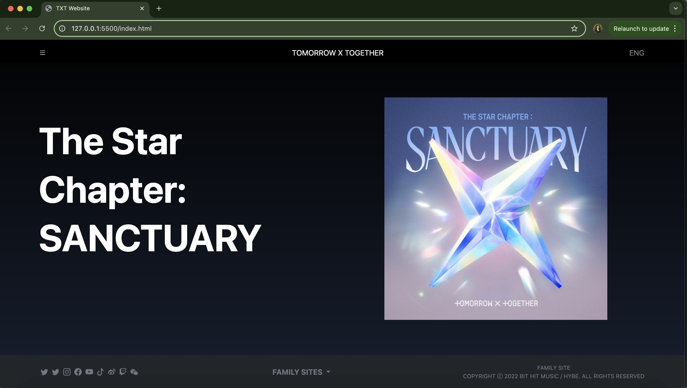
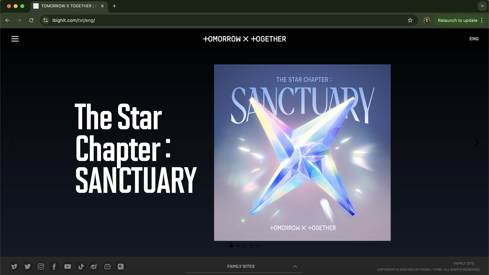

## Intro to UI frameworks

After become familiar with Typescript, we now have HTML and CSS thrust upon us! For around two years, we've programmed in languages like Java and C, and this is the first language I've worked with that actually provides a visual for my work! The days of reading prints in the terminal are no longer with HTML!

Though I am sure there is still much more to learn with this medium, I can say that I am enjoying a lot of it! Any kind of programming can challenege your creativity, but with HTML, assignments that require creativity and organization feel easier to complete and oddly rewarding!

  
## To Each Their Own

There aren't many programs that can be described as "simple" or "easy," programming is difficult for beginners. But, after all the messy starts I've had with each language I've learned, using Bootstrap features alongside HTML and CSS programming, building websites doesn't have to be so daunting!

Lots of my peers would prefer the use of HTML and CSS on its own, without Bootstrap. But I find the use of Bootstrap's built-in classes very helpful! Having to build a style class in CSS is inevitable and can get a little out of hand if you're making a larger website, but tagging another class at the top of a section without having to build a class can be simple!

Even when relying heavily on Bootstrap classes, it's likely that you'll still be using CSS. So why not accept some help! 

## Moving Forward

While I can notice some complications with UI Frameworks, complications can be found everywhere. The way I see things, it'll be easier to adjust to a UI Framework if it can provide a lot of unique help along the way. Especially if not using it would give you more work to do when building your website. Recreating website looks has been a really fun practice to do in class, below is an example I made with Bootstrap! The left is the original and the right is my recreation.

 

