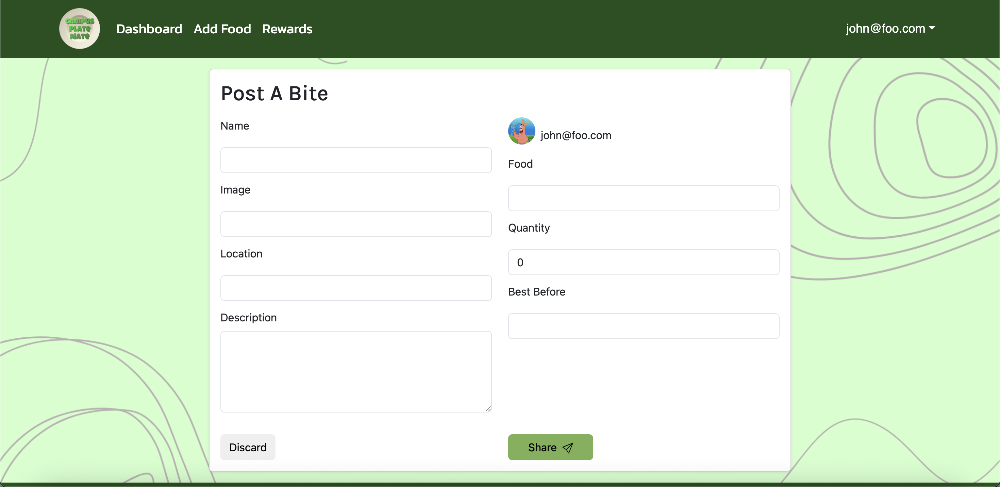

[Campus Plate Mate](https://plate-mate-bice.vercel.app/) is a group project built by me and my team members during ICS 314, our software engineering class. 

We created a web application that aims to reduce food waste around UH Manoa vis user-to-user interaction, featuring pages for food sharing, food claiming, and more. The more a user interacts with the site, the more points are added to their unique profiles. With these points, users can redeem prizes from our rewards page.

Here are some screenshots of unique pages found on our website:

### Add Food Page

### Dashboard

### Rewards Page

### Profile Page

My contributions to this project include a large portion of the front-end business like styling the pages and creating the logo! Once my teammates would get the website functioning, I would go in and make the page look more palatable as well as giving feedback on anything that might've been broken or asking for feedback on what I styled.

This group project really taught me how to mitigate work evenly between a team. You'll get to know everyone's strengths and weaknesses the more you work otgether, which can help task distribution become clearer and a more fair down the road. I also found what I cling to more passionately through this project. As building your own website, even with a template, requires the completion of a wide variety of tasks, I found what sticked with me and what made me happy to accomplish as well as what stressed me out and what I would get stuck on.

View our project on GitHub [here]([https://campusplatemate.github.io/).
